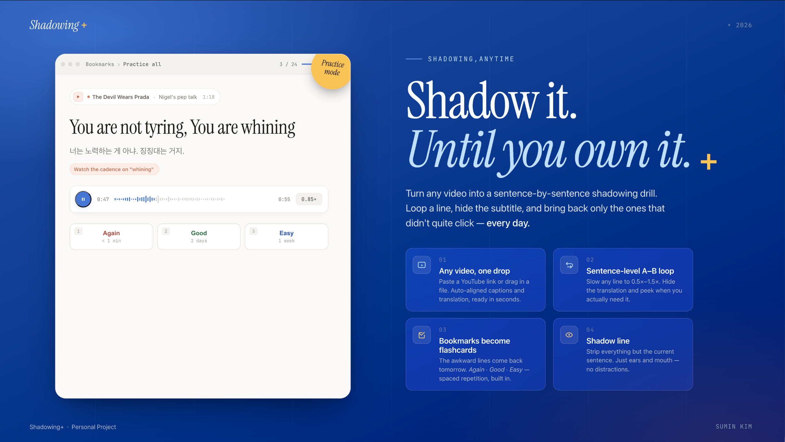
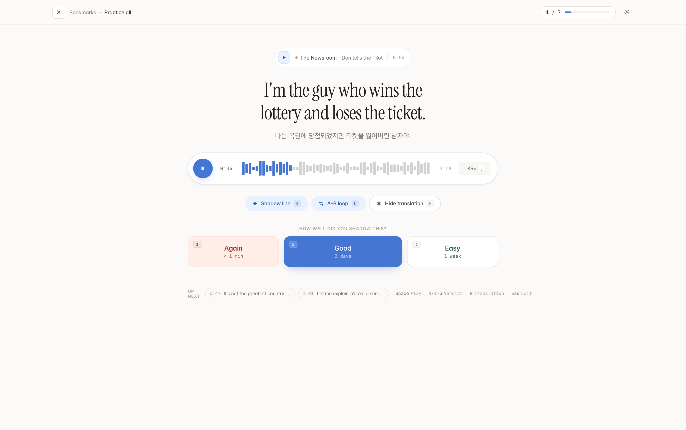

# Shadowing Plus

An English shadowing webapp + installable PWA. Drop in a video or audio file, get word-level transcripts with Korean translations, and shadow sentence-by-sentence. Bookmarks fuel a spaced-repetition practice mode that surfaces sentences when they're due.

<p align="center">
  
</p>

- **Library** — drag-drop upload, folder-based organization, dual-mode (video/audio) player.
- **Clip** — focus line + transcript side by side on desktop; bottom-dock mobile shell; A–B loop; per-line bookmarks; speed dropdown.
- **Bookmarks** — saved sentences grouped per clip, in-page playback with `endTime` snap.
- **Practice (SM-2 lite SRS)** — Again / Good / Easy verdicts schedule the next review. Mobile and desktop have separate optimized shells.
- **PWA** — installable on iOS / Android home screen with a placeholder "S+" icon (swap via [`web/scripts/generate-icons.mjs`](web/scripts/generate-icons.mjs)).

### Default language pair

This app is configured for **English audio → Korean translation** out of the box. All documentation (this README, `CLAUDE.md`) is written against that default.

To switch the language pair, edit [`web/src/lib/pipeline/languages.ts`](web/src/lib/pipeline/languages.ts):

- `AUDIO_LANGUAGE.code` — ISO 639-3 code sent to ElevenLabs Scribe v2 (e.g. `"eng"`, `"kor"`, `"jpn"`, `"spa"`).
- `AUDIO_LANGUAGE.name` — Human-readable name interpolated into the GPT-4o-mini translation prompt.
- `TRANSLATION_LANGUAGE` — The learner's native language; the language translations are generated in.

**Font caveat.** The translation typography in the UI uses **Pretendard**, which is tuned for Korean. If you change `TRANSLATION_LANGUAGE` to a non-Korean target, swap the sans font in [`web/src/app/layout.tsx`](web/src/app/layout.tsx) and the related `--font-*` variables for one optimized for your target language (e.g. Noto Sans JP for Japanese, Inter / Geist for European languages).

---

## Tech stack

- **Frontend** — Next.js 16 (App Router, Turbopack), React 19, Tailwind CSS 4, TypeScript 5.
- **Database** — Supabase Postgres. RLS is **disabled**; the anon key reads/writes directly. Realtime subscription on `jobs` drives live upload progress.
- **Media storage** — Cloudflare R2 (S3-compatible) for uploads, audio extracts, and pipeline JSON checkpoints. Free egress.
- **Processing** — 5-stage TypeScript pipeline that runs on Vercel API routes: `extract → transcribe → postprocess → translate → persist`. ElevenLabs Scribe v2 for ASR, GPT-4o-mini for translation.
- **Testing** — Vitest. Postprocess stages (5 modules) and the SRS algorithm are pure functions with table-driven tests.

---

## File structure

```
shadowing_plus/
├── supabase/migrations/
│   ├── 001_rebuild_schema.sql      # videos, segments, bookmarks, folders, jobs
│   ├── 002_disable_rls.sql         # forces RLS off (Supabase auto-re-enables)
│   ├── 003_folder_color.sql        # folders.color
│   └── 004_bookmarks_srs.sql       # SRS columns on bookmarks (ease, interval, due_at, lapses)
└── web/
    ├── public/icons/               # PWA icons (generated; replace with real logo)
    ├── scripts/generate-icons.mjs  # SVG → PNG icon generator (@resvg/resvg-js)
    └── src/
        ├── app/
        │   ├── layout.tsx          # fonts, viewport, manifest
        │   ├── manifest.ts         # PWA manifest (themed standalone, icons)
        │   ├── mobile.css          # all .m-* mobile-shell styles + media-query gate
        │   ├── globals.css, home.css, bookmarks/bookmarks.css, player/[videoId]/clip.css
        │   ├── page.tsx            # / — library (desktop + MobileLibrary)
        │   ├── bookmarks/page.tsx  # /bookmarks (desktop + MobileBookmarks)
        │   ├── player/[videoId]/page.tsx  # /player/[id] — dual shell, hoisted <video>
        │   ├── practice/
        │   │   ├── page.tsx        # /practice — fetches due bookmarks, renders both shells
        │   │   └── practice.css    # .pr-* + .m-practice-* styles
        │   └── api/
        │       ├── upload/route.ts          # presigned R2 URL + jobs row insert
        │       ├── jobs/route.ts            # GET list
        │       ├── jobs/[id]/route.ts       # GET / DELETE
        │       ├── jobs/[id]/run/route.ts   # start pipeline (orchestrator)
        │       ├── jobs/[id]/retry/route.ts # retry from a specific stage
        │       ├── videos/[id]/route.ts     # DELETE (cascades to R2 + DB)
        │       └── bookmarks/[id]/verdict/route.ts  # POST verdict → applyVerdict → DB
        ├── components/
        │   ├── AudioPlayer.tsx     # forwardRef wrapper over <audio>/<video>
        │   ├── UploadDropzone.tsx, JobCard.tsx
        │   ├── home/  Sidebar, NewFolderModal, Icons
        │   ├── clip/  ClipHeader, ClipPlayer (uses videoSlotRef), FocusLine,
        │   │          ClipControls (speed dropdown), Transcript, Icons
        │   ├── bookmarks/  BookmarkGroup, BookmarkItem, BookmarksEmpty, Icons
        │   ├── mobile/  MobileLibrary, MobileClip, MobileBookmarks,
        │   │            MobilePractice, MobileDrawer, MobileTabBar, Icons
        │   └── practice/  DesktopPractice
        └── lib/
            ├── types.ts            # all DB row types (Bookmark includes SRS state)
            ├── srs.ts              # SM-2-lite pure function + tests in __tests__/srs.test.ts
            ├── use-is-mobile.ts    # SSR-safe matchMedia hook (gates effects, not layout)
            ├── folder-color.ts     # deterministic palette + per-folder override
            ├── supabase.ts, supabase-admin.ts, r2.ts
            └── pipeline/
                ├── jobs.ts, orchestrator.ts
                ├── stage_1_extract.ts ... stage_5_persist.ts
                └── postprocess/    # 5 pure functions + vitest
```

### Architecture: dual shell

Library / Clip / Bookmarks / Practice each render **both** a desktop shell (`.home-app`, `.clip-page`, `.pr-page`) **and** a mobile shell (`.m-app`, `.m-practice`) on the same URL. CSS media queries hide whichever isn't applicable at `768px`. Data hooks live in the parent so both shells consume the same state.

The clip player hoists the single `<video>` element into a hidden pool and `useLayoutEffect` re-parents it into the active shell's `videoSlotRef` via `appendChild`. Playback state survives the swap.

---

## Setup

### 1. Install

```bash
git clone <repo-url>
cd shadowing_plus/web
npm install
```

### 2. Environment

Create `web/.env.local` from the keys below.

| Variable                        | Where to get it                                                  |
| ------------------------------- | ---------------------------------------------------------------- |
| `NEXT_PUBLIC_SUPABASE_URL`      | Supabase → Project settings → API                                |
| `NEXT_PUBLIC_SUPABASE_ANON_KEY` | Supabase → Project settings → API                                |
| `SUPABASE_SERVICE_KEY`          | Supabase → Project settings → API → `service_role` (server-only) |
| `OPENAI_API_KEY`                | platform.openai.com                                              |
| `ELEVENLABS_API_KEY`            | elevenlabs.io → My Account → API Keys                            |
| `R2_ACCOUNT_ID`                 | Cloudflare → R2 → top-right                                      |
| `R2_ACCESS_KEY_ID`              | Cloudflare → R2 → Manage R2 API Tokens                           |
| `R2_SECRET_ACCESS_KEY`          | Cloudflare → R2 → Manage R2 API Tokens                           |
| `R2_BUCKET_NAME`                | e.g. `shadowing-media`                                           |
| `R2_PUBLIC_URL`                 | the `pub-xxxxx.r2.dev` host shown after enabling public access   |

### 3. Apply Supabase migrations

Open Supabase → SQL Editor and run these **in order**:

1. [`supabase/migrations/001_rebuild_schema.sql`](supabase/migrations/001_rebuild_schema.sql) — creates `videos`, `segments`, `bookmarks`, `folders`, `jobs`; adds `jobs` to the realtime publication.
2. [`supabase/migrations/002_disable_rls.sql`](supabase/migrations/002_disable_rls.sql) — Supabase silently re-enables RLS on new tables; this forces it off again. Required for the anon key to read/write directly.
3. [`supabase/migrations/003_folder_color.sql`](supabase/migrations/003_folder_color.sql) — adds `folders.color` (per-folder accent dot).
4. [`supabase/migrations/004_bookmarks_srs.sql`](supabase/migrations/004_bookmarks_srs.sql) — adds SRS columns (`ease_factor`, `interval_days`, `due_at`, `last_verdict`, `last_reviewed_at`, `lapses`) + index. Backfills existing rows. Supabase may warn about an UPDATE without WHERE — that's the intentional backfill (uses `COALESCE`, safe to re-run).

### 4. Cloudflare R2 setup (one-time)

1. **Create bucket** — Cloudflare dashboard → R2 → Create bucket (e.g. `shadowing-media`).
2. **Enable public access** — bucket → Settings → "Public URL Access" → on. Copy the `pub-xxxxx.r2.dev` host into `R2_PUBLIC_URL`.
3. **API token** — R2 → Manage R2 API Tokens → Create. Permissions: **Object Read & Write**, scoped to the bucket. Copy the Access Key ID + Secret into env vars. Account ID is shown on the R2 dashboard sidebar.
4. **CORS policy** — bucket → Settings → CORS Policy:

   ```json
   [
     {
       "AllowedOrigins": [
         "http://localhost:3000",
         "https://<your-vercel-domain>"
       ],
       "AllowedMethods": ["GET", "PUT", "HEAD"],
       "AllowedHeaders": ["*"],
       "ExposeHeaders": ["ETag"],
       "MaxAgeSeconds": 3600
     }
   ]
   ```

### 5. Generate PWA icons (placeholder)

```bash
cd web && npm run icons
```

Drops `icon-192.png`, `icon-512.png`, `apple-touch-icon.png` into `web/public/icons/`. To swap in a real logo, edit the SVG template inside [`web/scripts/generate-icons.mjs`](web/scripts/generate-icons.mjs) and re-run. iOS caches install icons aggressively — a user who already added to home screen needs to remove and re-add to pick up a new icon.

### 6. Run

```bash
cd web
npm run dev       # http://localhost:3000
npm test          # vitest (postprocess + SRS)
npm run build     # production build (Turbopack)
npm run lint
```

---

## Deployment (Vercel)

```bash
# from the REPO ROOT, not web/
npx vercel --prod
```

This project is registered as a monorepo with `web/` as the root. Running `vercel` from inside `web/` triggers the 100 MB upload limit because Vercel CLI bundles `node_modules`. Always deploy from the repo root.

Add every key from `web/.env.local` to the Vercel project's environment variables before the first deploy.

---

## Features

### Pipeline (R2 + Vercel API routes)

| Stage           | Input               | Output                     | Tool                                                                                   |
| --------------- | ------------------- | -------------------------- | -------------------------------------------------------------------------------------- |
| 1 — extract     | source video        | `jobs/{id}/audio.mp3`      | `ffmpeg-static` (skipped for `audio` uploads)                                          |
| 2 — transcribe  | audio R2 key        | `raw_transcript.json`      | ElevenLabs Scribe v2 (`cloud_storage_url` = presigned R2 URL)                          |
| 3 — postprocess | raw transcript      | `segments.json`            | merge duplicates → drop empty → fix timing → regroup sentences → remove hallucinations |
| 4 — translate   | segments            | `segments_translated.json` | GPT-4o-mini, 5-segment batches with positional mapping                                 |
| 5 — persist     | translated segments | `videos` + `segments` rows | media-type-aware `audio_url`/`video_url`, marks job `ready`                            |

Each stage is idempotent and re-runnable from a job card's retry button. Postprocess is `Segment[] → Segment[]` with no I/O — tested standalone via [`web/src/lib/pipeline/postprocess/__tests__`](web/src/lib/pipeline/postprocess/__tests__).

### Practice (SRS)

<p align="center">
  
</p>

Bookmarks gain SRS state via migration 004. The verdict API ([`web/src/app/api/bookmarks/[id]/verdict/route.ts`](web/src/app/api/bookmarks/[id]/verdict/route.ts)) calls the pure [`applyVerdict()`](web/src/lib/srs.ts) function:

- **Again** — `interval = 0`, `ease −= 0.2` (floored at 1.3), `lapses += 1`, due in 1 min. In-session, the item is re-pushed to the back of the queue.
- **Good** — `interval = oldInterval === 0 ? 2 : oldInterval × ease` days. Ease unchanged.
- **Easy** — `interval = oldInterval === 0 ? 7 : oldInterval × ease × 1.3` days. Ease `+= 0.15`.

`/practice` server-fetches bookmarks where `due_at <= now()`, joined with segment + video for context. `?mode=all` ignores the due gate. `?clip=<id>` filters to a single clip. The page renders `<DesktopPractice>` (1480-wide top bar, 760-wide stage column, 76px verdict tiles) and `<MobilePractice>` (full-screen drill with SRS footer) side by side; CSS hides whichever doesn't match the viewport. An **Undo** button (desktop top bar / mobile footer) rolls back the most recent verdict, both client-side and on the server (via the `restore` branch of the verdict API).

### Keyboard shortcuts

**Player (`/player/[id]`, desktop):**

| Key     | Action                               |
| ------- | ------------------------------------ |
| `Space` | Play / Pause                         |
| `A`     | Previous segment                     |
| `D`     | Next segment                         |
| `S`     | Repeat current segment (Shadow line) |
| `R`     | Toggle A–B repeat                    |
| `T`     | Toggle translation                   |
| `← →`   | Seek ±3 seconds                      |

**Practice (`/practice`, desktop):**

| Key             | Action                                         |
| --------------- | ---------------------------------------------- |
| `Space`         | Play / Pause                                   |
| `1` / `2` / `3` | Verdict: Again / Good / Easy                   |
| `K` or `T`      | Toggle Korean translation (peek mode → reveal) |
| `L`             | Toggle A–B loop                                |
| `S`             | Toggle shadow mode                             |
| `,`             | Cycle playback speed                           |
| `Esc`           | Exit to bookmarks                              |

Mobile uses on-screen controls only — the same dock + chip system you see in the clip player.

---

## Mobile / PWA notes

- Same URLs serve both viewports; CSS media queries (`max-width: 768px`) switch the visible shell. Tokens live on `.m-app`, `.home-app`, `.clip-page`, `.pr-page` and propagate via the cascade — no portals.
- Safe-area-aware: `env(safe-area-inset-top/bottom)` is honored by the top bar, bottom tab bar, and clip dock so content clears the Dynamic Island and home indicator.
- The clip mobile shell pins player + focus at the top of the viewport; only the transcript scrolls inside its own container.
- Practice is mobile-friendly with a sticky verdict footer; verdicts and audio playback survive backgrounding.
- Service-worker / offline mode is **not** included. Practice requires network. iOS PWA installs cache the icon aggressively — if you change the icon, ask users to remove + re-add to home screen.

---

## Data wipe (dev only)

```bash
cd web && node --env-file=.env.local scripts/wipe-supabase.mjs
```

Deletes all rows and audio objects. Schema changes (DROP / CREATE) still need to be applied via the SQL editor — this is data-only.

---

## License

MIT

---

## Engineering notes (migrated from the former CLAUDE.md)

*The rest of the former CLAUDE.md duplicated this README / ARCHITECTURE.md; these are the bits that weren't documented elsewhere.*

### Next.js 16 gotchas
- `params`, `searchParams`, `cookies()`, `headers()` are all **Promises**. `await` them in server components. In client components use `use(params)`.
- `themeColor` lives in the `viewport` export, not `metadata` (deprecated path).
- API route handlers receive `{ params: Promise<{ id: string }> }`.

### Compute limits
- Vercel Hobby has a 60s timeout. A 1.5h video can hit it.
- Escalation order: (a) raise `maxDuration` on Pro, (b) Supabase Edge Functions (150s), (c) Inngest free tier.
- The code doesn't change; only the call site does. Today we run on (a).

### Dual-shell architecture
Library / Clip / Bookmarks / Practice each render **both** a desktop shell (`.home-app`, `.clip-page`, `.pr-page`) and a mobile shell (`.m-app`, `.m-practice`) on the same URL. CSS media queries at 768px gate which one paints. Data hooks live in the parent so both shells share state.

The clip page hoists the single `<video>` into a hidden pool; a `useLayoutEffect` re-parents it via `appendChild` into the active shell's `videoSlotRef`. Playback state survives the swap.

The mobile drawer is rendered **inline as a child of `.m-app`** (not via `createPortal`). Reason: a portal escapes the `.m-app` token scope, which makes iOS Safari's text-size-adjust inflate the drawer's fonts. z-index 50 on the drawer still trumps the tab bar (z:30) because `.m-app` doesn't create a stacking context.
