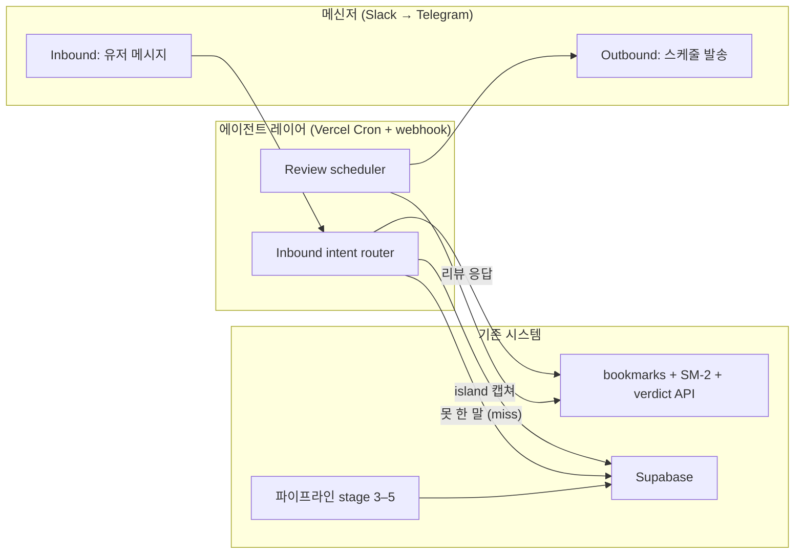
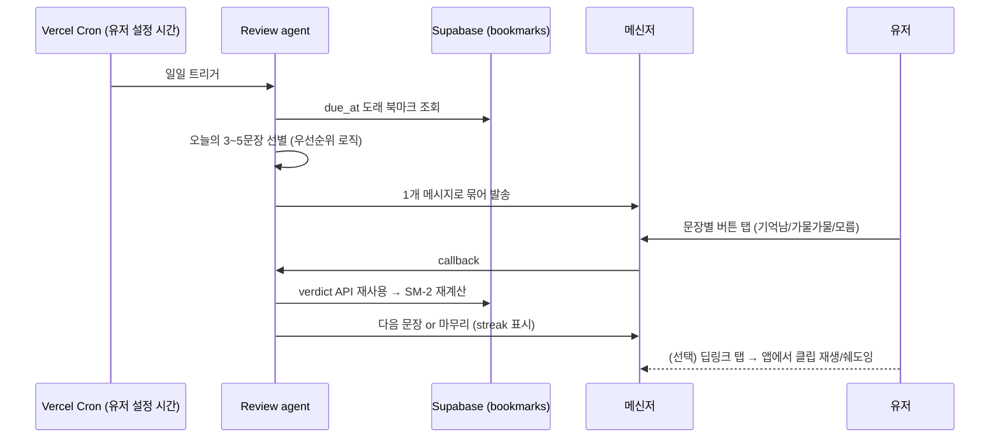
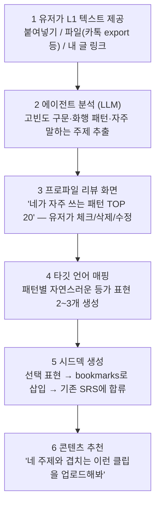
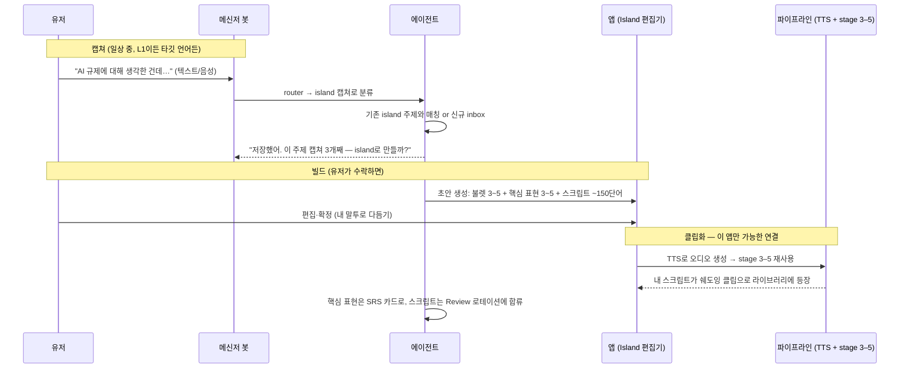
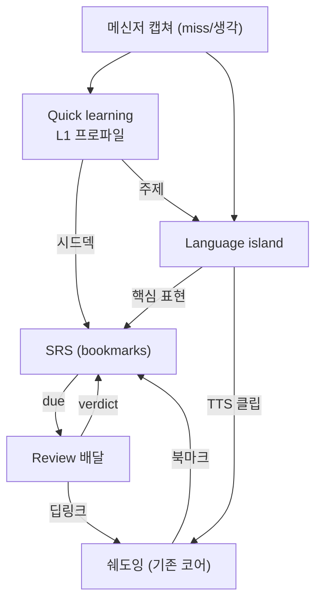

# 킥 기능 3개 — 상세 UX 플로우 (2026-07-10)

> ver2.0 plan. 전제: 채널은 v1 Slack(개인) → v2 Telegram(퍼블릭), 언어 중립 설계,
> 기존 파이프라인·SRS·verdict API 최대 재사용. 리서치 결정사항은
> `2026-07-10-productization-research-brainstorm.md` 참고.

---

## 0. 공통 아키텍처: 봇은 하나, 기능은 셋

세 기능은 전부 "메신저 ↔ 에이전트 ↔ 기존 DB/파이프라인" 패턴이라 봇 하나에 올린다.

**Inbound intent router가 핵심 신규 컴포넌트.** 유저가 봇에 보내는 모든 메시지를
LLM 1콜로 분류: `리뷰 응답` / `island 캡쳐` / `miss 기록` / `명령`. 유저는 기능을
구분해서 보낼 필요가 없다 — 그냥 봇에 말하면 됨.

**신규 인프라 없음:** 스케줄러는 Vercel Cron, 인바운드는 webhook route 하나.
(초안의 Cloud Run/Scheduler 안은 현 스택 유지가 더 싸므로 대체.)

---

## 1. Review — 복습 배달 에이전트

**JTBD:** "앉아서 복습해야지"라는 결심 없이도, 이미 보는 메신저에서 복습이 일어나게 한다.

### 플로우

### 메시지 설계 (레벨별)

| 레벨 | 형태 | 비고 |
| :---- | :---- | :---- |
| L0 | 문장 + 번역 가리기(스포일러) + 클립 딥링크 | 읽기만 해도 노출 효과. MVP |
| L1 | L0 + 인라인 버튼 3개 → **기존 verdict API로 바로 채점** | 앱 안 열어도 SRS 루프가 닫힘. 핵심 |
| L2 | 유저가 음성 답장으로 쉐도잉 → ASR로 비교 피드백 | 비용 발생. 유료 기능 후보, 후순위 |

### 규칙 (스팸 방지)

- 하루 **1개 메시지 고정**, 문장 3~5개 묶음. 알림 폭탄 금지.
- 3일 무반응 시 빈도 자동 감소(격일→주2회), "다시 매일 받을래?" 1회만 질문.
- due 항목 없으면 발송 안 함. 대신 주 1회 요약(이번 주 done/streak)은 선택 옵션.
- 시간·빈도·채널은 앱 `/settings`에서 관리 (이미 settings 페이지 있음).

### MVP 컷

L0+L1, Slack, 고정 아침 시간. 스키마 추가: `users.review_channel`, `review_time`,
`timezone` (인증 도입 전이면 단일 유저 설정 테이블로 시작).

---

## 2. Quick learning — L1 표현 프로파일

**JTBD:** 커리큘럼이 주는 말이 아니라 **내가 실제로 하는 말**부터 배우게 한다.
차별화 1순위 기능이자 랜딩 훅.

### 플로우 A — 온보딩 (프로파일 생성)

**3번이 UX의 핵심.** 분석 결과를 유저가 확인·편집하는 단계 없이 바로 덱을 만들면
신뢰를 잃는다. "맞아, 나 이 말 진짜 자주 해"라는 순간이 aha moment.

### 플로우 B — evolving (지속 갱신)

- **Miss 캡쳐:** 유저가 봇에 "오늘 ○○라고 말하고 싶었는데 못 했어"를 보냄(L1로).
  → router가 `miss`로 분류 → 타깃 언어 표현 2~3개 즉답 + 덱에 추가 제안.
  일상 속 실패가 그대로 다음 학습 항목이 되는 루프.
- **주기 재분석:** 월 1회 "새 텍스트 있으면 프로파일 업데이트할까?" 넛지 (강제 아님).
- **쉐도잉 연동:** 유저가 클립에서 북마크한 문장과 프로파일 패턴이 겹치면
  "네가 자주 쓰는 패턴이랑 같은 구조야" 라벨 → 개인화 체감.

### 프라이버시 (프로덕트화 전 확정 필요)

- v1: **붙여넣기/파일 업로드만** (메신저 OAuth 수집 안 함). 원문은 분석 후 폐기,
  저장은 파생 프로파일(패턴 목록)만. 이 원칙을 랜딩에 명시 — 신뢰가 곧 기능.
- 카톡 export 파서는 한국 유저용 편의 기능일 뿐, 코어는 "임의의 L1 텍스트"로 언어 중립.

### MVP 컷

붙여넣기 입력 + 프로파일 리뷰 화면 + 시드덱 생성까지. Miss 캡쳐는 island와 라우터를
공유하므로 island MVP에 얹어서 함께.

### 스키마 초안

`l1_profiles` (user_id, patterns jsonb, topics jsonb, updated_at),
`expression_cards` (profile 유래 표현 — bookmarks와 통합할지가 설계 쟁점 ①).

---

## 3. Language island — 주제 스크립트 연습

**JTBD:** 한 주제에 대한 내 생각을 목표 언어의 "내 스크립트"로 굳혀서, 실전에서
꺼내 쓸 수 있는 섬(island)을 만든다. 책상 앞 정리가 아니라 일상 중 캡쳐로.

### 플로우

### 넛지 규칙

- 에이전트가 먼저 말 거는 경우는 두 가지뿐: (a) 같은 주제 캡쳐가 2~3개 쌓였을 때
  "island로 만들까?", (b) 완성된 island를 2주 이상 안 봤을 때 Review 메시지에 끼워서.
- 주제 제안은 Quick learning 프로파일의 topics에서 가져옴 (기능 간 연결).

### Island의 상태 모델

`inbox(캡쳐 쌓임) → drafting(초안 생성됨) → active(클립화, 연습 중) → resting`
— videos.practice_status(none/focusing/done)와 유사한 패턴이라 UI 재사용 가능.

### MVP 컷

캡쳐 + 주제 묶기 + 앱에서 초안 생성·편집까지. TTS 클립화는 그다음 스프린트
(파이프라인 재사용이라 작지만, TTS 비용·음성 선택 결정 필요 — 쟁점 ③).

---

## 4. 기능 간 루프 (전체 그림)

들어오는 문은 셋(업로드, L1 프로파일, 캡쳐)이지만 전부 SRS로 모이고, SRS는 Review로
나간다. **Review가 리텐션 엔진, Quick learning이 획득 훅, Island가 유료 전환 가치.**

## 5. 빌드 순서 제안

| 순서 | 항목 | 이유 |
| :---- | :---- | :---- |
| 1 | 봇 스켈레톤 + Review L0/L1 (Slack) | 라우터·스케줄러 기반이 되고, 본인이 매일 쓰는 가치가 즉시 나옴 |
| 2 | Inbound router + island 캡쳐 + miss 캡쳐 | 인바운드 절반. 캡쳐 데이터가 쌓여야 3·4가 의미 있음 |
| 3 | Quick learning 온보딩 (붙여넣기 → 프로파일 → 시드덱) | 앱 쪽 UI 작업. 랜딩 훅과 동시 준비 |
| 4 | Island 빌드/편집 + TTS 클립화 | 파이프라인 재사용. 유료 기능 후보 |
| 5 | Telegram 어댑터 이전 | 퍼블릭 베타 직전 |

## 6. 설계 쟁점

**결정됨 (2026-07-10, Sumin 확정):**

1. **표현 카드는 bookmarks에 통합.** `segment_id`를 nullable로 바꾸고
   `source`('clip'/'profile'/'island') + 표현 텍스트 컬럼 추가. SRS·verdict·Review를
   수정 없이 재사용. 클립 딥링크 등 UI는 source별 분기.
2. **Review 채점은 메신저 안에서 완결.** 리텐션(복습 완료율)을 앱 DAU보다 우선.
   딥링크는 보조 경로로 유지.

**미결:**

3. **Island TTS 음성** — ElevenLabs TTS(품질↑, 비용↑) vs OpenAI TTS(저렴).
   "내 스크립트"인 만큼 목소리 선택권을 줄지, 비용상 고정할지.
4. **캡쳐의 음성 입력** — 일상 캡쳐는 음성이 자연스러운데 ASR 비용·처리 지연 발생.
   v1 텍스트만 vs 처음부터 음성 허용.
